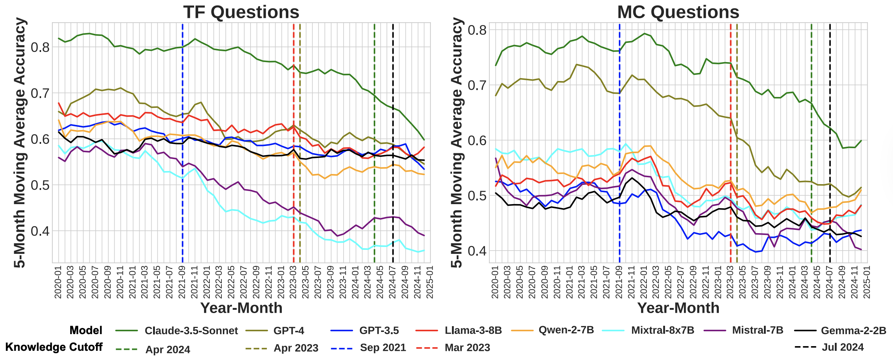
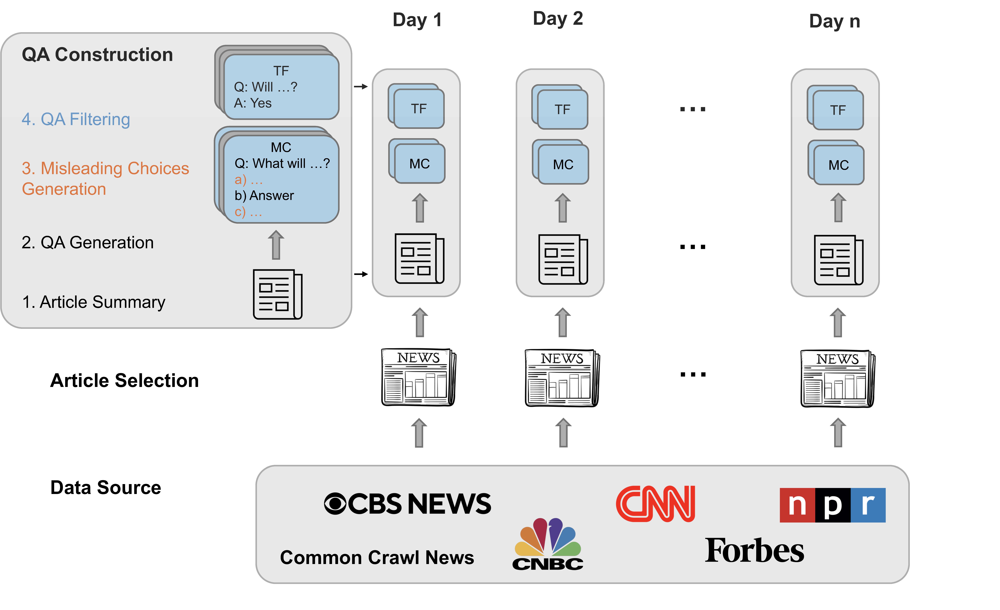

# Are LLMs Prescient? A Continuous Evaluation using Daily News as the Oracle
### [Paper](https://arxiv.org/pdf/2411.08324) | [Website](https://agenticlearning.ai/daily-oracle/) | [Dataset](https://drive.google.com/drive/folders/1zMmV5RRxBIcwavxhLvAz-0ZlkVeQPQRG)

**Daily Oracle** is a continuous evaluation benchmark using automatically generated QA pairs from daily news to assess how the future prediction capabilities of LLMs evolve over time.



## Setup
```bash
git clone git@github.com:agentic-learning-ai-lab/daily-oracle.git
cd daily-oracle
pip install -r requirements.txt
```

## QA Generation
`/qa-generation` folder contains code for generating TF (True/False) and MC (Multiple Choice) QA pairs from daily news, with news articles selected either randomly or based on hot topics.



**Step 1: Select news articles from hot topics** 

Run the following command to select news articles from the top three hot topics of the day. Ensure the news file is located in the `/news` directory.
```bash
python qa-generation/hot_topic_selection.py \
  --start_date 2024-07-01 \
  --end_date 2024-07-04 \
  --input_path ./news/<news-file-name>.csv \
  --output_path ./data/raw_data
```

**Step 2: Generate TF and MC QA pairs**

Run the following command to generate QA pairs

1. from random news articles
```bash
python qa-generation/main.py \
  --article_selection random \
  --start_date 2024-07-01 \
  --end_date 2024-07-04 \
  --input_path ./news/<news-file-name>.csv \
  --output_path ./data/raw_data
```
2. from selected hot topic news articles (need to run Step 1 first)
```bash
python qa-generation/main.py \
  --article_selection selected \
  --start_date 2024-07-01 \
  --end_date 2024-07-04 \
  --input_path ./data/raw_data \
  --output_path ./data/raw_data
```

**Step 3: Clean the generated data**

In Step 2, the raw QA pairs will be saved as pickle file and need postprocess to filter and retain only valid questions. Use the following command to clean the data:
```bash
python qa-generation/clean_raw_data.py \
  --start_date 2024-07-01 \
  --end_date 2024-07-04 \
  --input_path ./data/raw_data \
  --output_path ./data/clean_data
```

## Evaluation

**Supported models:**
gpt-35, gpt-4, gpt-4o-mini, gpt-4o, claude-3-5-sonnet, llama3, mistral-7b, mixtral-8x7b, gemma2-2b, qwen2-7b. You can also add new models under `load_model()` function in `/evaluation/eval.py`.

### Closed-Book Setting

In closed-book setting, we ask the questions directly without providing extra information.

```bash
python evaluation/eval.py \
  --eval_setting closed-book \
  --model_name gpt-35 \
  --input_path ./data/clean_data/<question-file-name>.csv \
  --output_path ./evaluation/results
```

### Constraint Open-Book Setting

In the constrained open-book setting, we explore how access to news articles up to different time cutoffs influences LLM performance using RAG.

**Step 1: Tokenize data for RAG**
```bash
python evaluation/rag_tokenize_data.py \
  --news_path ./news/<news-file-name>.csv \
  --question_path ./data/clean_data/<question-file-name>.csv \
  --output_path ./evaluation/rag_data/input
```

**Step 2: Retrieve articles**
- `RAG_cutoff`: the latest accessible date for retrieving articles \
- The accessible date range for a question with resolution date `d_res` is [start_date_of_news_corpus, min(`d_res` − 1, `RAG_cutoff`))

- For questions' resolution date is \
a) before RAG_cutoff, we have dynamic_cutoff with the retriver having information up to `d_res`-1 \
b) after RAG_cutoff, we have a fixed retreiver with information up to RAG_cutoff

For the following command, use `--dynamic_cutoff` for scenario (a). For scenario (b), omit the flag.

```bash
python evaluation/rag.py \
  --news_path ./evaluation/rag_data/input/<news-file-name>_tokenized.pkl \
  --question_path ./evaluation/rag_data/input/<question-file-name>_tokenized.pkl \
  --output_path ./evaluation/rag_data/output \
  --cutoff_date 2024-03-01 \
  --dynamic_cutoff
```

**Step 3: Evaluation**

Note that the `--input path` should be the pickle file generated in Step 2.
```bash
python evaluation/eval.py \
  --eval_setting open-book \
  --model_name gpt-35 \
  --input_path ./evaluation/rag_data/output/cutoff_<cutoff_date>/<rag-question-file-name>.pkl \
  --output_path ./evaluation/results 
```

### Gold Article Setting
In the gold article setting, models are provided direct access to the gold article, from which the question is generated.
```bash
python evaluation/eval.py \
  --eval_setting gold-article \
  --model_name gpt-35 \
  --input_path ./data/clean_data/<question-file-name>.csv \
  --output_path ./evaluation/results
```

## BibTex
```bibtex
@article{dai2024dailyoracle,
  title={Are LLMs Prescient? A Continuous Evaluation using Daily News as the Oracle},
  author={Dai, Hui and Teehan, Ryan and Ren, Mengye},
  journal={arXiv preprint arXiv:2411.08324},
  year={2024}
}
```